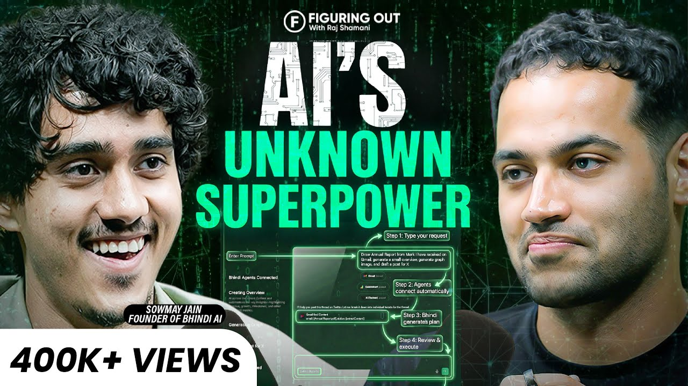

  

            

              
            

          

<!-- css files -->

#banner {
background: url(./assets/hero-bg.png);
background-repeat: no-repeat;
background-size: cover;
height: 760px;
/_ display: flex; _/
/_ align-items: center; _/
/_ justify-content: center; _/
position: relative;
border: 2px solid red;

.containerr {
position: absolute;
transform: translate(-50%,-50%);
top: 50%;
left: 50%;
display: flex;
flex-direction: column;
align-items: center;
border: 2px solid red;
.microphone:;
-webkit-transform: translate(-50%,-50%);
-moz-transform: translate(-50%,-50%);
-ms-transform: translate(-50%,-50%);
-o-transform: translate(-50%,-50%);
{
border: 2px solid red;
border: 3px solid #533c72;
padding: 75px 75px;
border-radius: 1000px;
-webkit-border-radius: 1000px;
-moz-border-radius: 1000px;
-ms-border-radius: 1000px;
-o-border-radius: 1000px;
background: var(--linear-gradient);
width: 200px;
height: 200px;
position: relative;

      .mic-img {
        display: none;
      }
    }

}
}

<!-- html files -->

          

          

            <h1>TechWave</h1>
            

              Your daily dose of tech insights, productivity hacks, and personal
              growth
            

            

              

                <i class="fa-brands fa-spotify"></i>
              

            

          

        

            <a href="https://youtu.be/1IxG7ywSNXk" target="_blank" class="card">
                

                    
                    

                        

                    

                

                

                   <h3>Ge</h3>
                    

                    

                        <svg width="16" height="16" viewBox="0 0 24 24" fill="none" stroke="currentColor" stroke-width="2" stroke-linecap="round" stroke-linejoin="round"><circle cx="12" cy="12" r="10"></circle><polyline points="12 6 12 12 16 14"></polyline></svg>
                        35 min
                    

                

            </a>

            <a href="https://youtu.be/RMAux-sD1bA" target="_blank" class="card">
                

                    
                    

                        

                    

                

                

                    <h3>Smartest Way To Use AI: Powerful Words, Tools & Next Revolution | Sowmay Jain | Raj Shamani</h3>
                    
AI is rewriting how we build, work, and create value. In this episode, Sowmay Jain—Founder of Upsurge Labs and Bhindi, and Co-founder of Instadapp—breaks down where real opportunities in AI exist today, why messaging and productivity apps are still wide open, and how software is being rebuilt from scratch. From AI-driven businesses to a future that blurs the line between humans and machines, this conversation explores what’s coming next—and what’s already here.

                    

                        <svg width="16" height="16" viewBox="0 0 24 24" fill="none" stroke="currentColor" stroke-width="2" stroke-linecap="round" stroke-linejoin="round"><circle cx="12" cy="12" r="10"></circle><polyline points="12 6 12 12 16 14"></polyline></svg>
                        51 min
                    

                

            </a>
